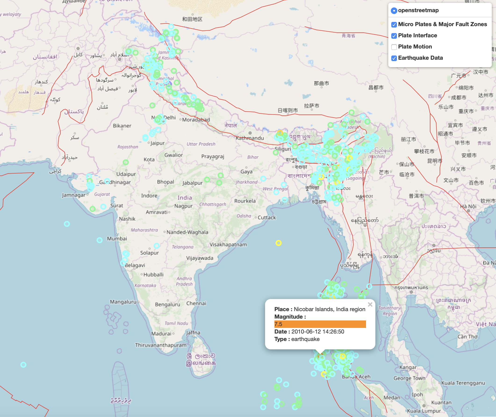
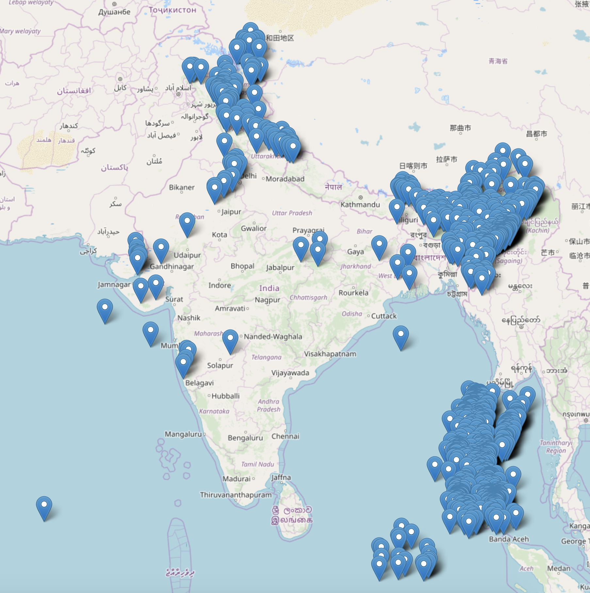

# Visualize earthquake's on Indian Sub Continent between 2010 to 2019
A Project to Visualize history of earthquake's on Indian Sub Continent on Map. 

## Installation

This is a **Python 3.6** module that depends on the **Folium** packages.

1. Clone and `cd` into this repo.
2. Install **Python 3.6**.
3. Install requirements from pip with `python3 -m pip install -r requirements.txt`.
4. Test the program by running `visualize-earthquake.py` 

## Usage
Just run `visualize-earthquake.py` file. The output will be a html file `earthquake_india.html` under `\maps` folder. 

Information on GeoJSON Detail Format can be found [here](https://earthquake.usgs.gov/earthquakes/feed/v1.0/geojson_detail.php)

## Data
All data used in this example is sourced from below websites.
* **USGS**
    * https://earthquake.usgs.gov/
* **Mygeodata**
    * https://mygeodata.cloud/r
* **Shape files**
    * https://github.com/fraxen/tectonicplates

## Map

#### Version 2.0
This is upgraded version of my previous attempt to visualize the earthquakes in Indian Sub-Continent. I have added the following to make it user friendly
* **Added four layers to the visualization**
    * Micro Plates & Major Fault Zones
    * Plate Interface
    * Plate Motion
    * Earthquake Data
* A**dded Colored Indicators to map**
    * Color depends on the magnitude of earthquake.
* **Tooltips**
    * Hovering over the circles will display information
* **Popup Information**
    * When user clicks on any one of the circle following information are displayed
        * Place of earthquake
        * Magnitude of earthquake which is color coded too
        * Date when the earthquake happened
        * Type information


#### Version 1.0
This is a basic visualization of earthquake in Indian Sub-Continent. The Blue markers shown in the map are places where the earthquake occured between 2010 to 2019.


## References
* [Modified Mercalli intensity scale](https://en.wikipedia.org/wiki/Modified_Mercalli_intensity_scale)
* [Magnitude / Intensity Comparison](https://earthquake.usgs.gov/learn/topics/mag_vs_int.php)
* [GIS Lounge](https://www.gislounge.com/find-tectonic-plate-gis-data/)

## Sample Json File

```json
{
    "type": "FeatureCollection",
    "metadata": {
        "generated": 1554093997000,
        "url": "https://earthquake.usgs.gov/fdsnws/event/1/query?format=geojson&minlatitude=3&minlongitude=37&maxlatitude=63&maxlongitude=98&starttime=2019-01-01&endtime=2019-01-03",
        "title": "USGS Earthquakes",
        "status": 200,
        "api": "1.7.0",
        "count": 6
    },
    "features": [{
        "type": "Feature",
        "properties": {
            "mag": 4.3,
            "place": "45km NNW of Lar, Iran",
            "time": 1546443571930,
            "updated": 1552067414040,
            "tz": 210,
            "url": "https://earthquake.usgs.gov/earthquakes/eventpage/us2000izui",
            "detail": "https://earthquake.usgs.gov/fdsnws/event/1/query?eventid=us2000izui&format=geojson",
            "felt": null,
            "cdi": null,
            "mmi": null,
            "alert": null,
            "status": "reviewed",
            "tsunami": 0,
            "sig": 284,
            "net": "us",
            "code": "2000izui",
            "ids": ",us2000izui,",
            "sources": ",us,",
            "types": ",geoserve,origin,phase-data,",
            "nst": null,
            "dmin": 3.584,
            "rms": 0.9,
            "gap": 46,
            "magType": "mb",
            "type": "earthquake",
            "title": "M 4.3 - 45km NNW of Lar, Iran"
        },
        "geometry": {
            "type": "Point",
            "coordinates": [54.2376, 28.0799, 10]
        },
        "id": "us2000izui"
    }, {
        "type": "Feature",
        "properties": {
            "mag": 4.9,
            "place": "16km NNE of Borazjan, Iran",
            "time": 1546415849570,
            "updated": 1552067413040,
            "tz": 210,
            "url": "https://earthquake.usgs.gov/earthquakes/eventpage/us2000izsm",
            "detail": "https://earthquake.usgs.gov/fdsnws/event/1/query?eventid=us2000izsm&format=geojson",
            "felt": 2,
            "cdi": 3.1,
            "mmi": null,
            "alert": null,
            "status": "reviewed",
            "tsunami": 0,
            "sig": 370,
            "net": "us",
            "code": "2000izsm",
            "ids": ",us2000izsm,",
            "sources": ",us,",
            "types": ",dyfi,geoserve,origin,phase-data,",
            "nst": null,
            "dmin": 6.22,
            "rms": 1.07,
            "gap": 70,
            "magType": "mb",
            "type": "earthquake",
            "title": "M 4.9 - 16km NNE of Borazjan, Iran"
        },
        "geometry": {
            "type": "Point",
            "coordinates": [51.3003, 29.3932, 10]
        },
        "id": "us2000izsm"
    }, {
        "type": "Feature",
        "properties": {
            "mag": 4.6,
            "place": "18km NNE of Borazjan, Iran",
            "time": 1546360756490,
            "updated": 1552067413040,
            "tz": 210,
            "url": "https://earthquake.usgs.gov/earthquakes/eventpage/us2000iznl",
            "detail": "https://earthquake.usgs.gov/fdsnws/event/1/query?eventid=us2000iznl&format=geojson",
            "felt": null,
            "cdi": null,
            "mmi": null,
            "alert": null,
            "status": "reviewed",
            "tsunami": 0,
            "sig": 326,
            "net": "us",
            "code": "2000iznl",
            "ids": ",us2000iznl,",
            "sources": ",us,",
            "types": ",geoserve,origin,phase-data,",
            "nst": null,
            "dmin": 6.261,
            "rms": 0.82,
            "gap": 71,
            "magType": "mb",
            "type": "earthquake",
            "title": "M 4.6 - 18km NNE of Borazjan, Iran"
        },
        "geometry": {
            "type": "Point",
            "coordinates": [51.2694, 29.4236, 10]
        },
        "id": "us2000iznl"
    }, {
        "type": "Feature",
        "properties": {
            "mag": 4.2,
            "place": "27km SE of Jarm, Afghanistan",
            "time": 1546357264830,
            "updated": 1552067413040,
            "tz": 270,
            "url": "https://earthquake.usgs.gov/earthquakes/eventpage/us2000iznh",
            "detail": "https://earthquake.usgs.gov/fdsnws/event/1/query?eventid=us2000iznh&format=geojson",
            "felt": null,
            "cdi": null,
            "mmi": null,
            "alert": null,
            "status": "reviewed",
            "tsunami": 0,
            "sig": 271,
            "net": "us",
            "code": "2000iznh",
            "ids": ",us2000iznh,",
            "sources": ",us,",
            "types": ",geoserve,origin,phase-data,",
            "nst": null,
            "dmin": 0.987,
            "rms": 0.52,
            "gap": 70,
            "magType": "mb",
            "type": "earthquake",
            "title": "M 4.2 - 27km SE of Jarm, Afghanistan"
        },
        "geometry": {
            "type": "Point",
            "coordinates": [71.0378, 36.6758, 231.87]
        },
        "id": "us2000iznh"
    }, {
        "type": "Feature",
        "properties": {
            "mag": 4.9,
            "place": "86km WSW of Banda Aceh, Indonesia",
            "time": 1546343702180,
            "updated": 1552067413040,
            "tz": 360,
            "url": "https://earthquake.usgs.gov/earthquakes/eventpage/us2000izmv",
            "detail": "https://earthquake.usgs.gov/fdsnws/event/1/query?eventid=us2000izmv&format=geojson",
            "felt": 2,
            "cdi": 2.7,
            "mmi": null,
            "alert": null,
            "status": "reviewed",
            "tsunami": 0,
            "sig": 370,
            "net": "us",
            "code": "2000izmv",
            "ids": ",us2000izmv,",
            "sources": ",us,",
            "types": ",dyfi,geoserve,moment-tensor,origin,phase-data,",
            "nst": null,
            "dmin": 2.379,
            "rms": 0.93,
            "gap": 39,
            "magType": "mww",
            "type": "earthquake",
            "title": "M 4.9 - 86km WSW of Banda Aceh, Indonesia"
        },
        "geometry": {
            "type": "Point",
            "coordinates": [94.5625, 5.3785, 43.76]
        },
        "id": "us2000izmv"
    }, {
        "type": "Feature",
        "properties": {
            "mag": 4.2,
            "place": "2km SE of Yedisu, Turkey",
            "time": 1546308576160,
            "updated": 1552067413040,
            "tz": 120,
            "url": "https://earthquake.usgs.gov/earthquakes/eventpage/us2000izk9",
            "detail": "https://earthquake.usgs.gov/fdsnws/event/1/query?eventid=us2000izk9&format=geojson",
            "felt": null,
            "cdi": null,
            "mmi": null,
            "alert": null,
            "status": "reviewed",
            "tsunami": 0,
            "sig": 271,
            "net": "us",
            "code": "2000izk9",
            "ids": ",us2000izk9,",
            "sources": ",us,",
            "types": ",geoserve,origin,phase-data,",
            "nst": null,
            "dmin": 0.596,
            "rms": 0.41,
            "gap": 55,
            "magType": "mb",
            "type": "earthquake",
            "title": "M 4.2 - 2km SE of Yedisu, Turkey"
        },
        "geometry": {
            "type": "Point",
            "coordinates": [40.5636, 39.4228, 10]
        },
        "id": "us2000izk9"
    }],
    "bbox": [40.5636, 5.3785, 10, 94.5625, 39.4228, 231.87]
}

```
## Disclaimer
All data used in this example is sourced from internet. The Author does not take guarantee of accuracy.  


